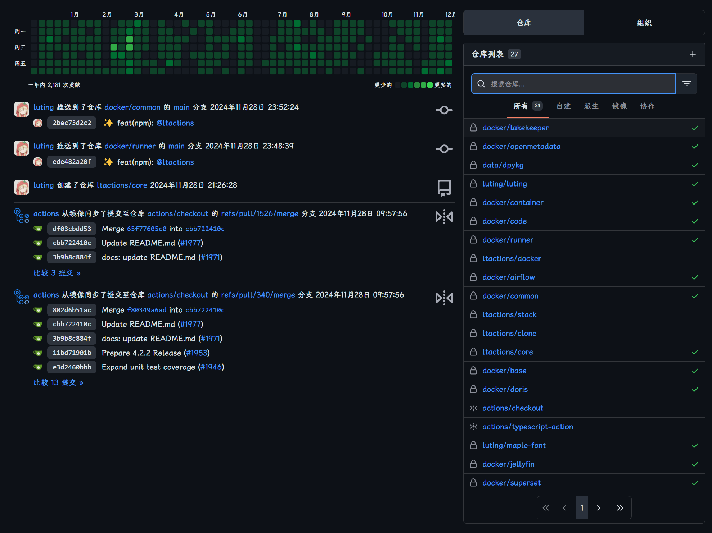
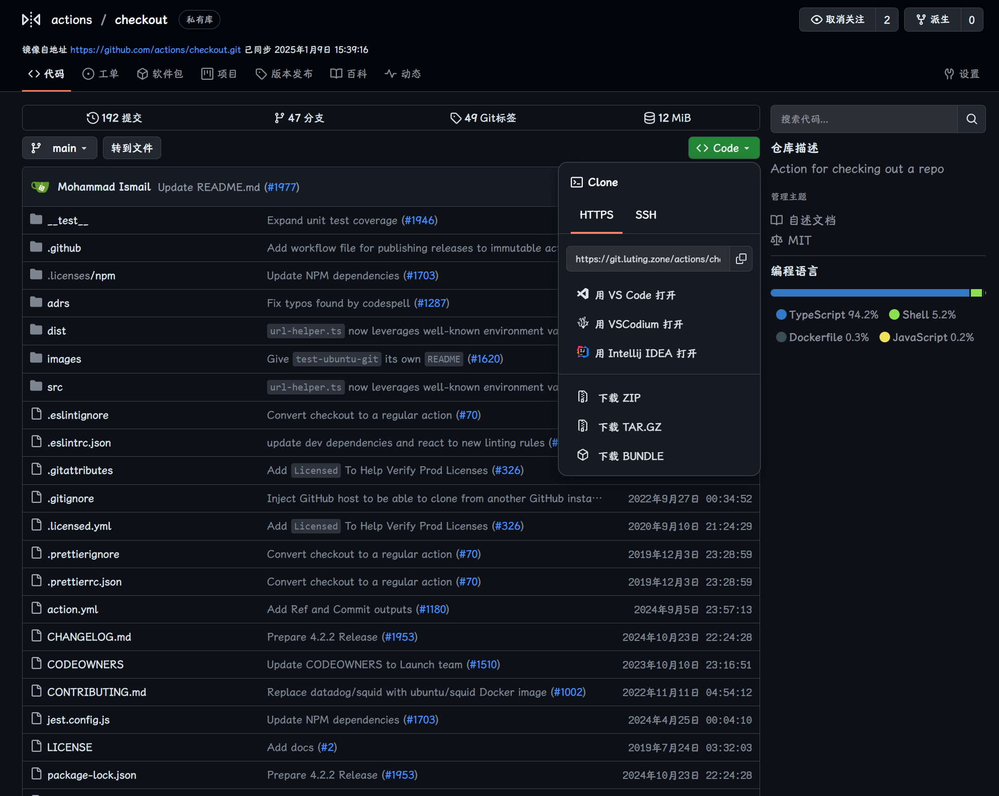
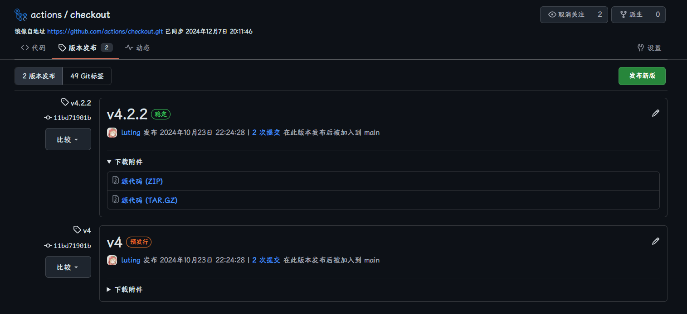
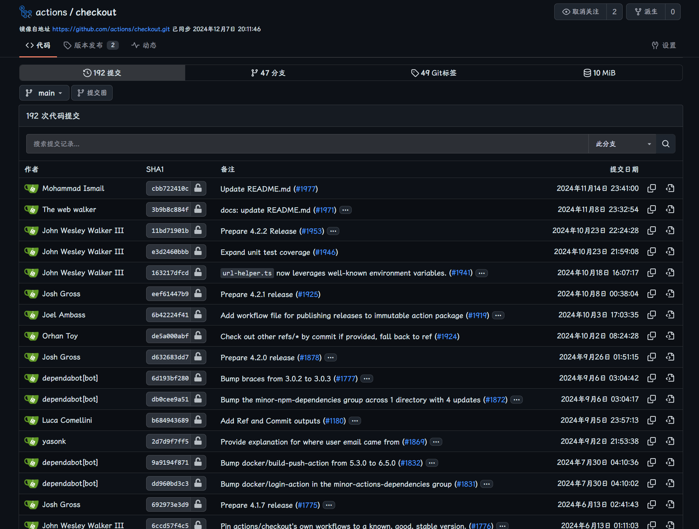
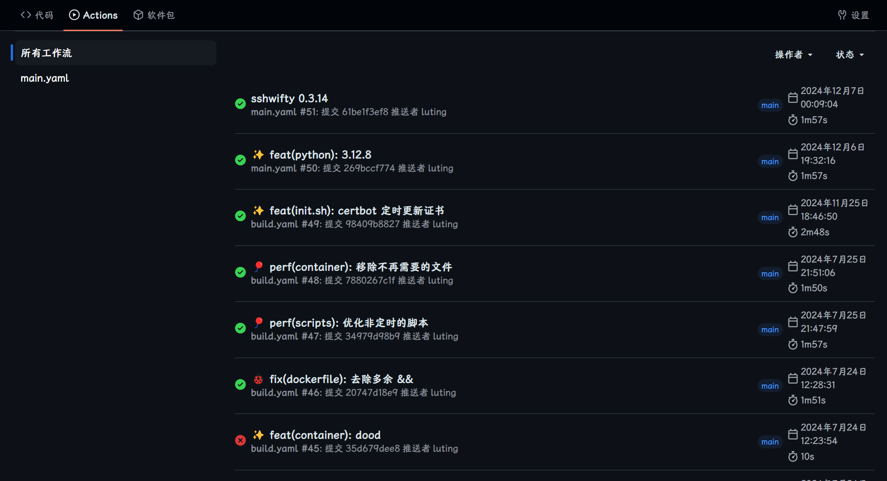
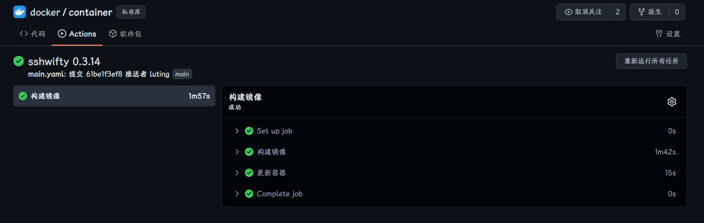
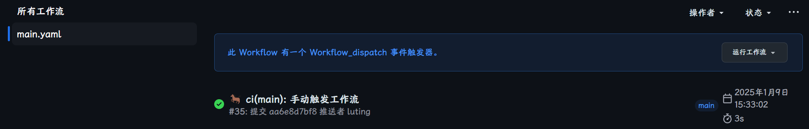

# gitea-github-theme

尽量保持与 GitHub 相同样式的 Gitea 主题

### 主题说明

添加了短暂的过渡动画优化体验(与 GitHub Code 克隆列表动画一致)

推荐搭配文件图标浏览器插件一起使用更佳
[github-file-explorer-icons](https://github.com/catppuccin/github-file-explorer-icons)

## 安装

1. 在发布页下载最新的 `theme-github-dark.css` 放入 `gitea/public/assets/css` 目录下
2. 修改 `gitea/conf/app.ini`，并将 `, github` 附加到 `[ui]` 下的 `THEMES` 末尾
3. 重启 Gitea
4. 在设置中查看主题

`gitea/conf/app.ini` 例:

```ini
[ui]
THEMES = gitea-dark, github-dark
```

详细请查看 Gitea 文档
[Gitea docs](https://docs.gitea.com/next/administration/customizing-gitea#customizing-the-look-of-gitea)

## 自定义 CSS 变量

可以根据自己的偏好自定义主题的一部分样式

### 使用方法

在主题的 CSS 文件中头部或尾部添加以下代码

```css
:root {
  --custom-clone-menu-width: 150px;.
  ...
}
```

>[!IMPORTANT]
>
>请确保在 `:root` 选择器中添加自定义变量，否则无法生效
>
>变量之间用 `;` 分隔
>
>建议自定义变量放在单独的文件中, 通过 shell 命令等方式追加到主题文件中

### CSS 变量

| 变量名                    | 描述         | Gitea (默认值) | Github | 推荐  | 最小值 | 最大值 |
| :------------------------ | :----------- | :------------- | :----- | :---- | :----- | :----- |
| --custom-clone-menu-width | 克隆菜单宽度 | 232px          | 332px  | 200px | 150px  | 400px  |

## 截图















## 贡献

欢迎提交 Issue 或 Pull Request

```

```
