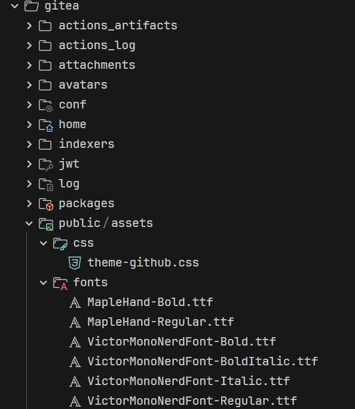

# gitea-github-theme

尽量保持与 GitHub Dark 相同样式的 Gitea 主题


### 主题说明

添加了短暂的过渡动画优化体验(与 GitHub Code 克隆列表动画一致)

UI 默认字体 [Maple Hand](https://github.com/subframe7536/maple-font/tree/other-resources/cn-resource/maple-hand) & [VictorMono Nerd Font](https://github.com/ryanoasis/nerd-fonts/releases/download/v3.3.0/VictorMono.zip) (优先匹配 `Maple Hand`, 需要系统包含相应字体, 否则使用默认字体)

## 安装

1. 在发布页下载最新的 `theme-github.css` 放入 `gitea/public/assets/css` 目录下
2. 修改 `gitea/conf/app.ini`，并将 `, github` 附加到 `[ui]` 下的 `THEMES` 末尾
3. 重启 Gitea
4. 在设置中查看主题

`gitea/conf/app.ini` 例:
```ini
[ui]
THEMES = gitea-dark, github
```

详细请查看 Gitea 文档 [Gitea docs](https://docs.gitea.com/next/administration/customizing-gitea#customizing-the-look-of-gitea)

### 集成字体

如果不想手动在系统安装字体, 可以将字体放入 Gitea 中, 在访问时拉取字体文件

>[!CAUTION]
>
> 不推荐此行为, 字体文件较大, 且一些字体粗细样式可能会有缺失
>
> 页面会在加载完字体后切换字体

1. 在发布页下载最新的 `theme-github-fonts.tar.gz` 解压后放入 `gitea/public/assets` 目录下
2. 清除浏览器缓存, 强制刷新浏览器查看效果

文件位置如下:



## 截图


## 构建

需要 nodejs 和 npm

```bash
git clone https://github.com/lutinglt/gitea-github-theme.git
cd gitea-github-theme
npm install
npm run build:theme
```

查看用于 Gitea 的主题文件: `./dist/theme-github.css`

在开发过程中实时构建主题文件

```bash
npm run watch
```

## 贡献

欢迎提交 Issue 或 Pull Request