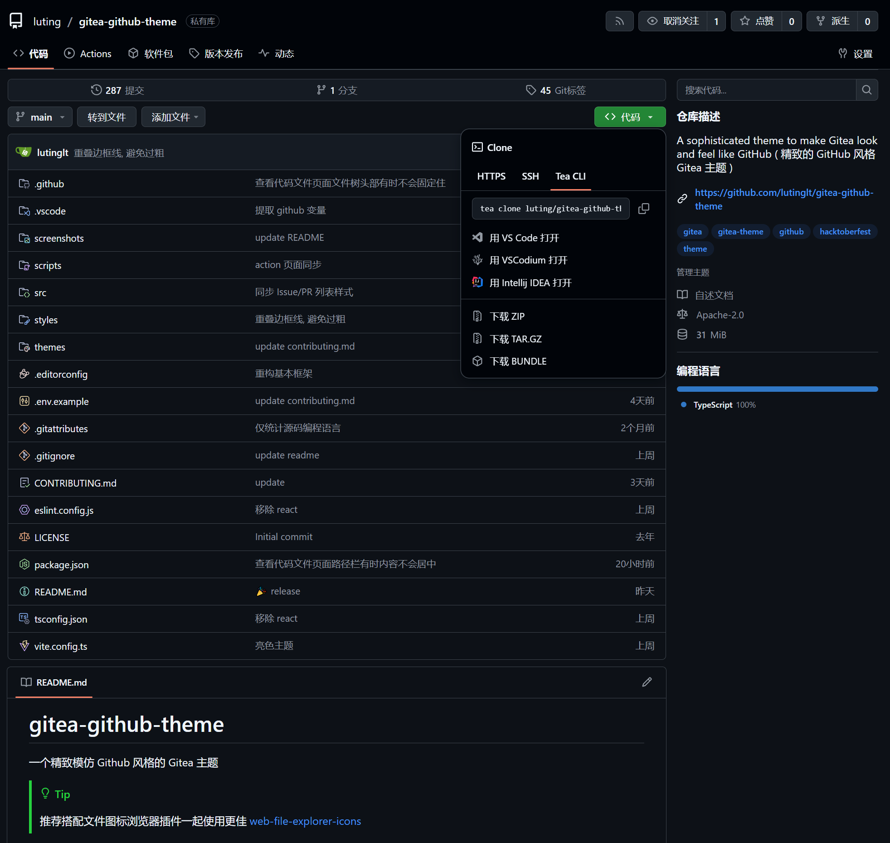

# gitea-github-theme

一个精致模仿 Github 风格的 Gitea 主题

> [!TIP]
>
> 推荐搭配文件图标浏览器插件一起使用更佳
> [web-file-explorer-icons](https://github.com/catppuccin/web-file-explorer-icons)

## 版本号说明

本主题版本号格式: `Gitea 版本号.时间戳`

Gitea 版本号格式: `1.大版本号.小版本号`

Gitea 理论上小版本号变更不会修改前端布局, 所以本主题的小版本号适用于所有 Gitea 大版本号相同的 Gitea 版本.

比如: 本主题版本 `1.24.4` 适用于 Gitea 版本 `>=1.24.0` ~ `<1.25.0`

本主题仅维护本主题发布中的最新的 Gitea 版本, 其他旧版本主题不接受 Issue 和 PR.

## 安装

1. 在发布页下载最新的 CSS 主题文件放入 `gitea/public/assets/css` 目录下
2. 修改 `gitea/conf/app.ini`，并将 CSS 文件名去掉 `theme-` 的名称附加到 `[ui]` 下的 `THEMES` 末尾
3. 重启 Gitea
4. 在设置中查看主题

> [!IMPORTANT]
>
> 自动颜色主题需要亮色和暗色的主题文件

例: 主题文件名为 `theme-github-dark.css`，则添加 `github-dark` 到 `THEMES` 末尾

`gitea/conf/app.ini` 例:

```ini
[ui]
THEMES = gitea-auto, gitea-light, gitea-dark, github-auto, github-light, github-dark, github-soft-dark
```

详细请查看 Gitea 文档
[Gitea docs](https://docs.gitea.com/next/administration/customizing-gitea#customizing-the-look-of-gitea)

## 自定义 CSS 变量

可以根据自己的偏好自定义主题的一部分样式

### 使用方法

在主题的 CSS 文件的头部或尾部添加以下代码

```css
:root {
  --custom-clone-menu-width: 150px;
  ...
}
```

> [!IMPORTANT]
>
> 请确保在 `:root` 选择器中添加自定义变量，否则无法生效
>
> 变量之间用 `;` 分隔
>
> 建议自定义变量放在单独的文件中, 通过 shell 命令等方式追加到主题文件中

### CSS 变量

| 变量名                            | 描述                        | 默认值 | Github | 推荐  | 最小值 | 最大值 |
| :-------------------------------- | :-------------------------- | :----- | :----- | :---- | :----- | :----- |
| --custom-clone-menu-width         | 克隆菜单宽度                | Gitea  | 332px  | 200px | 150px  | 400px  |
| --custom-explore-repolist-columns | 探索页面的仓库列表列数      | 2      | 2      | 2     |        |        |
| --custom-explore-userlist-columns | 探索页面的用户/组织列表列数 | 3      | 1      | 2/3   |        |        |
| --custom-user-repolist-columns    | 用户页面的仓库列表列数      | 2      | 2      | 1/2   |        |        |
| --custom-org-repolist-columns     | 组织页面的仓库列表列数      | 1      | 1      | 1/2   |        |        |
| --custom-org-userlist-columns     | 组织页面的用户列表列数      | 2      | 1      | 1/2   |        |        |

## 截图

<details open>
<summary>GitHub</summary>
<h4>亮色:</h4>

<h4>暗色:</h4>

<h4>柔和暗色:</h4>

</details>


<details>
<summary>其他主题</summary>
等待贡献者ing...
</details>

## 使用开发中的主题

也许你会想使用开发中的主题, 而不是发布的主题

请确保你已经安装了 Node.js 环境, 推荐使用 Node.js 20 或以上版本

```bash
git clone https://github.com/lutinglt/gitea-github-theme.git
cd gitea-github-theme
npm install
npm run build
```

编译完成后, 会在 `dist` 目录下生成主题文件, 你可以将主题文件放入 `gitea/public/assets/css` 目录下, 然后在 `gitea/conf/app.ini` 中添加主题名称到 `THEMES` 末尾


## 贡献

请查看 [CONTRIBUTING](CONTRIBUTING.md)
