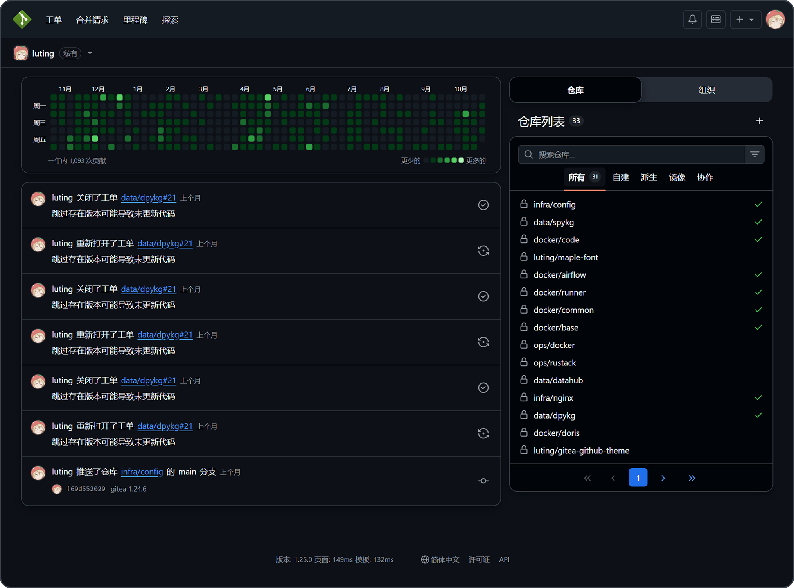

<h1 align="center">
  <p>Gitea GitHub Theme</p>
  
  
  
  
</h1>

<h4 align="center">

不仅仅是在颜色上, 在样式细节上也追求 GitHub 风格的 Gitea 主题

</h4>



> [!TIP]
>
> 推荐搭配 Catppuccin 文件图标浏览器插件一起使用更佳
> [web-file-explorer-icons](https://github.com/catppuccin/web-file-explorer-icons)

## 版本号说明

主题版本号与 Gitea 版本号保持一致

Gitea 版本号格式: `1.大版本号.小版本号`

Gitea 理论上小版本号变更不会修改前端布局, 所以主题的小版本号适用于所有 Gitea 大版本号相同的 Gitea 版本.

比如: 主题版本 `1.24.5` 适用于 Gitea 版本 `>=1.24.0` `<1.25.0`

仅维护项目发布中的最新的 Gitea 版本, 其他旧版本主题不接受 Issue 和 PR.

> 开发阶段的主题版本号格式: `1.大版本号.小版本号.时间戳`

### 主题版本发布规则

- 当 Gitea 发布小版本时, 主题中间如有变更, 则发布新的和 Gitea 小版本相同的主题版本
- 当 Gitea 发布大版本时, 主题中间如有变更, 会发布 `1.旧大版本号.latest` 的主题版本并不再维护旧版本
- 适配大版本的预发布版本为 `1.大版本号.rc`, 当无明显 BUG 时发布与 Gitea 大版本相同的主题版本

## 安装

1. 在发布页下载最新的 CSS 主题文件放入 `data/gitea/public/assets/css` 目录下 (默认可能没有此目录需手动创建)
2. 修改 `data/gitea/conf/app.ini`，并将 CSS 文件名去掉 `theme-` 的名称附加到 `[ui]` 下的 `THEMES` 末尾
3. 重启 Gitea
4. 在设置中查看主题

例: 主题文件名为 `theme-github-dark.css`，则添加 `github-dark` 到 `THEMES` 末尾

`data/gitea/conf/app.ini` 例:

```ini
[ui]
THEMES = gitea-auto, gitea-light, gitea-dark, github-auto, github-light, github-dark, github-soft-dark
```

详细请查看 Gitea 文档
[Gitea docs](https://docs.gitea.com/next/administration/customizing-gitea#customizing-the-look-of-gitea)

> [!IMPORTANT]
>
> 自动颜色主题需要亮色和暗色的主题文件

### 模板文件安装 (可选)

1. 在发布页下载最新的模板文件放入 `data/gitea/templates` 目录下 (默认可能没有此目录需手动创建)
2. 重启 Gitea

> [!IMPORTANT]
>
> 模板修改了 Gitea 的布局, 使其更接近 GitHub 的布局, 请勿跨版本使用模板文件, 可能会导致功能缺失等问题
>
> 模板布局跟 Gitea 实例绑定, 所有主题都会生效, 会影响其他非本项目的主题的体验

### 翻译文件安装 (可选)

> [!TIP]
>
> 仅在使用本项目的模板文件时需要安装翻译文件以提供非英文语言的支持

1. 在发布页下载最新的翻译文件放入 `data/gitea/options/locale` 目录下 (默认可能没有此目录需手动创建)
2. 重启 Gitea

> [!NOTE]
>
> 中文翻译中还额外将 "工单" 替换为 "议题", "合并请求" 替换为 "拉取请求", 以与 GitHub 手机版中文保持一致

## 截图

### 基本主题

```ini
THEMES = github-auto, github-light, github-dark, github-soft-dark
```

<details>
<summary>Base</summary>
<h4>theme-github-light.css</h4>

<h4>theme-github-dark.css</h4>

<h4>theme-github-soft-dark.css</h4>

</details>

### 色盲主题 ( Beta )

```ini
THEMES = github-colorblind-auto, github-colorblind-light, github-colorblind-dark
THEMES = github-tritanopia-auto, github-tritanopia-light, github-tritanopia-dark
```

<details>
<summary>Colorblind & Tritanopia (红绿色盲 & 蓝色盲)</summary>
<h4>theme-github-colorblind-light.css & theme-github-tritanopia-light.css</h4>

<h4>theme-github-colorblind-dark.css & theme-github-tritanopia-dark.css</h4>

</details>

### 粉色主题

```ini
THEMES = github-pink-auto, github-pink-light, github-pink-dark, github-pink-soft-dark
```

<details>
<summary>Pink</summary>
<h4>theme-github-pink-light.css</h4>

<h4>theme-github-pink-dark.css</h4>

<h4>theme-github-pink-soft-dark.css</h4>

</details>

## 自定义 CSS 变量

可以根据自己的偏好自定义主题的一部分样式

### 使用方法

在主题的 CSS 文件的头部或尾部添加以下代码

```css
:root {
  --custom-clone-menu-width: 150px;
  ...
}
```

> [!IMPORTANT]
>
> 请确保在 `:root` 选择器中添加自定义变量，否则无法生效
>
> 变量之间用 `;` 分隔
>
> 建议自定义变量放在单独的文件中, 通过 shell 命令等方式追加到主题文件中

### CSS 变量

| 变量名                            | 描述                        | 默认  | Github | 推荐  | 最小  | 最大  |
| :-------------------------------- | :-------------------------- | :---- | :----- | :---- | :---- | :---- |
| --custom-branch-menu-width        | 分支菜单的宽度              | 320px | 320px  | 320px | Gitea | 640px |
| --custom-clone-menu-width         | 克隆按钮的菜单宽度          | Gitea | 332px  | 200px | 150px | 400px |
| --custom-user-menu-width          | 用户菜单的宽度              | 192px | 256px  |       | Gitea | 320px |
| --custom-explore-repolist-columns | 探索页面的仓库列表列数      | 2     | 2      | 2     |       |       |
| --custom-explore-userlist-columns | 探索页面的用户/组织列表列数 | 3     | 1      | 2/3   |       |       |
| --custom-user-repolist-columns    | 用户页面的仓库列表列数      | 2     | 2      | 1/2   |       |       |
| --custom-org-repolist-columns     | 组织页面的仓库列表列数      | 1     | 1      | 1/2   |       |       |
| --custom-org-userlist-columns     | 组织页面的用户列表列数      | 2     | 1      | 1/2   |       |       |

## 使用开发中的主题

也许你会想使用开发中的主题, 而不是发布的主题

请确保你已经安装了 Node.js 环境, 推荐使用 Node.js 20 或以上版本

```bash
git clone https://github.com/lutinglt/gitea-github-theme.git
cd gitea-github-theme
npm install
npm run build
```

编译完成后, 会在 `dist` 目录下生成主题文件, 你可以将主题文件放入 `gitea/public/assets/css` 目录下, 然后在
`gitea/conf/app.ini` 中添加主题名称到 `THEMES` 末尾
