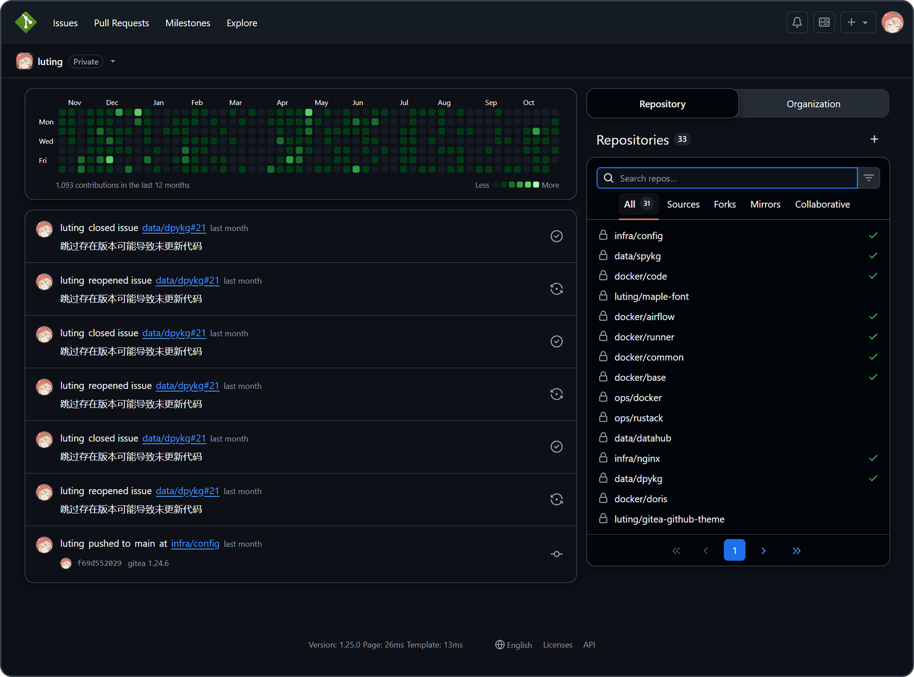

<p align="center">
  <a href="./README.md">中文</a> |
  English
</p>

# Gitea GitHub Theme

> [!IMPORTANT]
>
> Automatic color theme requires both light and dark theme files.

> [!TIP]
>
> Recommend using Catppuccin file icon browser plugin together for better performance.
> [web-file-explorer-icons](https://github.com/catppuccin/web-file-explorer-icons)

## Version Number Explanation

The theme version number is kept consistent with the Gitea version number

Gitea version number format: `1.major.minor`

Theoretically, minor version changes in Gitea do not modify the frontend layout, so the minor version of the theme is
applicable to all Gitea versions with the same major version number.

For example: Theme version `1.24.5` is applicable to Gitea versions `>=1.24.0` `<1.25.0`

Only the latest released Gitea version is maintained. Issues and PRs for other older theme versions will not be
accepted.

> Development stage theme version number format: `1.major.minor.timestamp`

## Installation

1. Download the latest CSS theme file from the release page and place it in the `gitea/public/assets/css` directory
2. Modify `gitea/conf/app.ini` and append the CSS filename without the `theme-` prefix to the end of `THEMES` under the
   `[ui]` section
3. Restart Gitea
4. Check the theme in the settings

Example: If the theme filename is `theme-github-dark.css`, add `github-dark` to the end of `THEMES`

Example `gitea/conf/app.ini`:

```ini
[ui]
THEMES = gitea-auto, gitea-light, gitea-dark, github-auto, github-light, github-dark, github-soft-dark
```

For details, please refer to the Gitea documentation
[Gitea docs](https://docs.gitea.com/next/administration/customizing-gitea#customizing-the-look-of-gitea)

## Screenshots



### Basic Themes

```ini
THEMES = github-auto, github-light, github-dark, github-soft-dark
```

<details>
<summary>Base</summary>
<h4>theme-github-light.css</h4>

<h4>theme-github-dark.css</h4>

<h4>theme-github-soft-dark.css</h4>

</details>

### Colorblind Themes (Beta)

```ini
THEMES = github-colorblind-auto, github-colorblind-light, github-colorblind-dark
THEMES = github-tritanopia-auto, github-tritanopia-light, github-tritanopia-dark
```

<details>
<summary>Colorblind & Tritanopia</summary>
<h4>theme-github-colorblind-light.css & theme-github-tritanopia-light.css</h4>

<h4>theme-github-colorblind-dark.css & theme-github-tritanopia-dark.css</h4>

</details>

### Pink Themes

```ini
THEMES = github-pink-auto, github-pink-light, github-pink-dark, github-pink-soft-dark
```

<details>
<summary>Pink</summary>
<h4>theme-github-pink-light.css</h4>

<h4>theme-github-pink-dark.css</h4>

<h4>theme-github-pink-soft-dark.css</h4>

</details>

## Custom CSS Variables

You can customize parts of the theme style according to your preferences

### Usage Method

Add the following code at the beginning or end of the theme's CSS file

```css
:root {
  --custom-clone-menu-width: 150px;
  ...
}
```

> [!IMPORTANT]
>
> Please ensure to add custom variables in the `:root` selector, otherwise they will not take effect
>
> Variables are separated by `;`
>
> It is recommended to place custom variables in a separate file and append them to the theme file using shell commands
> or other methods

### CSS Variables

| Variable Name                     | Description                                              | Default | Github | Recommend | Min   | Max   |
| :-------------------------------- | :------------------------------------------------------- | :------ | :----- | :-------- | :---- | :---- |
| --custom-branch-menu-width        | Branch menu width                                        | 320px   | 320px  | 320px     | Gitea | 640px |
| --custom-clone-menu-width         | Clone button menu width                                  | Gitea   | 332px  | 200px     | 150px | 400px |
| --custom-user-menu-width          | User menu width                                          | 192px   | 200px  |           | Gitea | 320px |
| --custom-explore-repolist-columns | Number of repository list columns on explore page        | 2       | 2      | 2         |       |       |
| --custom-explore-userlist-columns | Number of user/organization list columns on explore page | 3       | 1      | 2/3       |       |       |
| --custom-user-repolist-columns    | Number of repository list columns on user page           | 2       | 2      | 1/2       |       |       |
| --custom-org-repolist-columns     | Number of repository list columns on organization page   | 1       | 1      | 1/2       |       |       |
| --custom-org-userlist-columns     | Number of user list columns on organization page         | 2       | 1      | 1/2       |       |       |

## Using Development Version of the Theme

You might want to use the development version of the theme instead of the released version

Please ensure you have Node.js environment installed, Node.js 20 or above is recommended

```bash
git clone https://github.com/lutinglt/gitea-github-theme.git
cd gitea-github-theme
npm install
npm run build
```

After compilation, theme files will be generated in the `dist` directory. You can place the theme files into the
`gitea/public/assets/css` directory, then add the theme name to the end of `THEMES` in `gitea/conf/app.ini`

## Contribution

Please refer to [CONTRIBUTING](CONTRIBUTING.md)
